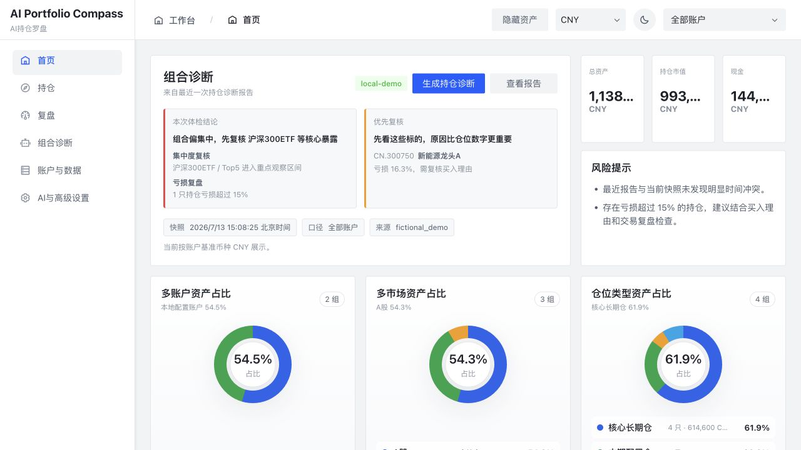
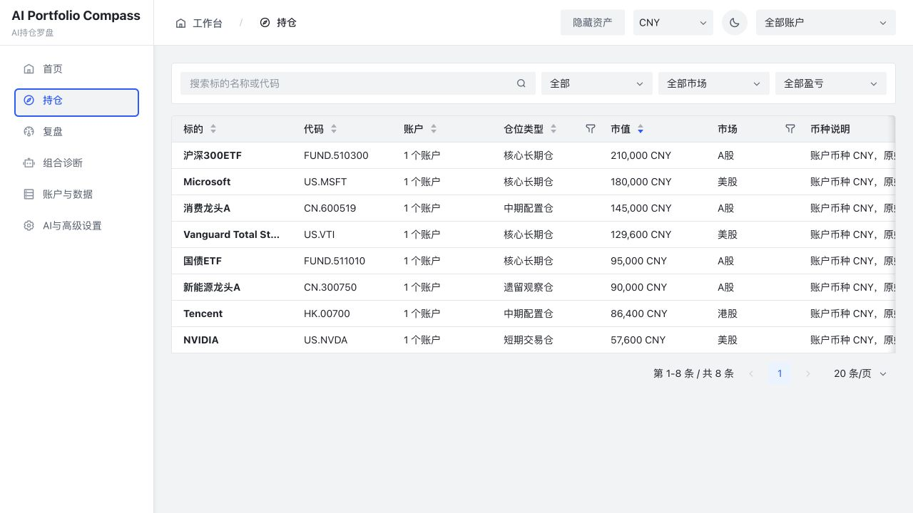
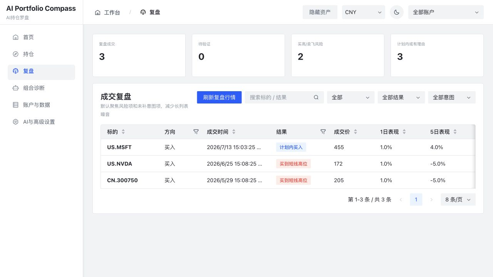

# AI Portfolio Compass

> AI 持仓罗盘：一个把多个证券账户放到同一张地图里的本地投资组合工作台
>
> 中文 | [English](#english)

AI Portfolio Compass 的起点很朴素：很多个人投资者并不只有一个账户。A 股基金、A 股股票、美股、港股、券商账户、手动导入资产，常常散落在不同 App 和不同市场里。你可能知道每个账户里有什么，却很难一眼看清“我到底完整持有什么、集中风险在哪里、哪些仓位真的需要处理”。

这个项目首先要解决的是 **多账户、多市场、多币种资产的统一查看与分析**。在此基础上，它再把真实持仓、历史成交、仓位意图、行情新闻和复盘结果放进同一个本地系统，让 AI 在有上下文、有边界、有记录的前提下辅助你做投资组合管理。

它不是又一个“问 AI 今天买什么”的聊天壳子。AI 是能力层，不是项目本体；项目本体是一套属于个人投资者自己的资产总览、组合诊断和复盘系统。

它关注的不是单次答案，而是一个持续闭环：

```text
多账户资产汇总 -> 仓位分层 -> 组合诊断 -> 今日行动 -> 标的分析 -> 交易复盘 -> 用户画像更新
```

项目默认运行在你的电脑上。真实账户数据、API Key、本地数据库、日志和导入文件都应留在本地，不应提交到 Git，也不会被项目默认上传到云端。

> 本项目仅用于研究、记录和辅助决策，不构成投资建议；项目不实现下单、撤单、改单或交易解锁流程。

## 界面预览

以下截图全部使用隔离的虚构演示数据，不包含真实账户、持仓或交易信息。



| 统一持仓视图 | 成交复盘视图 |
| --- | --- |
|  |  |

## 为什么做这个项目

很多个人投资者的问题并不是“缺一个买卖点”，而是缺一个能把所有资产放在一起看、并长期跟踪自己投资行为的系统：

- A 股基金、A 股股票、美股、港股分散在不同账户里，没有统一资产总览。
- 不同账户、市场和币种的口径不一致，很难判断真实仓位、现金比例和集中度。
- 长期仓、波段仓、短线仓和期权仓混在一起，结果用同一套止盈止损逻辑处理。
- 买入时有理由，持有一段时间后理由丢了，只剩盈亏数字牵动情绪。
- AI 可以生成漂亮分析，但如果不知道你的仓位、成本、交易历史和风险偏好，答案很容易变成泛泛而谈。
- 盘中提醒太吵，真正该处理的风险反而被淹没。
- 交易结束后很少复盘，所以系统也无法知道哪些建议真的有用。

AI Portfolio Compass 想解决的是这个更长期的问题：让 AI 成为你的投资组合“副驾驶”，而不是一次性的荐股机器。

## 项目精髓

### 1. 真实账户驱动，而不是纯问卷画像

系统通过 Futu / moomoo OpenD 或本地导入读取不同账户、市场、持仓、成交和自选数据。它先把分散资产合并成一个组合视图，再基于真实交易行为动态推断用户画像，而不是只靠“你是稳健型还是进取型”这种问卷：

- 跨账户总资产、现金和持仓市值
- A 股、港股、美股等市场暴露
- 不同币种资产的归一化口径
- 资金分层和现金比例
- 持仓周期与加减仓行为
- 单票集中度和主题暴露
- 深度亏损仓、遗留仓和杠杆/期权风险
- 用户手动修正后的真实仓位意图

### 2. 仓位分层，让 AI 不再一刀切

同一只股票，作为长期核心仓、短期交易仓或遗留观察仓，应该对应完全不同的分析逻辑。系统会把持仓识别为：

- 核心长期仓：关注长期逻辑、组合权重、趋势是否被破坏。
- 中期配置仓：关注阶段趋势、成本区、目标位和失效条件。
- 短期交易仓：关注纪律、止损、成交量和交易理由是否仍成立。
- 期权仓：关注到期日、时间价值、波动率和最大亏损。
- 遗留观察仓：关注是否仍有持有理由，而不是机械止损。

用户可以手动修正仓位类型，后续分析会优先尊重人工标记。

### 3. 从“建议”走向“今日行动”

首页不是堆满行情，而是把最需要处理的事项提炼成行动清单：

- 哪些组合风险需要先看
- 哪些持仓已经接近失效条件
- 哪些标的只是观察，不值得被盘中噪音打断
- 哪些数据已经过期，因此不应该生成强提醒

系统强调克制提醒：数据不足就标记为信息不足，低置信度就降级为观察，不输出“立即买入”“必涨”“稳赚”这类强指令文案。

### 4. 复盘闭环，而不是只生成漂亮报告

每一次 AI 建议、用户查看、用户修正和后续交易都可以进入复盘链路。系统会把成交记录和后续行情结合起来，帮助你观察：

- 这笔交易是计划内执行，还是追高/卖飞/止损拖延
- AI 的提醒是否真的有帮助
- 哪些仓位需要重新定义持有理由
- 用户画像是否应该随着行为变化而更新

### 5. 本地优先和安全边界

这个项目从第一版就把安全边界放在核心位置：

- 只读同步，不执行交易动作。
- 不保存交易密码。
- 不调用交易解锁、下单、撤单、改单接口。
- API Key 只从环境变量读取。
- 外部 AI 调用需要显式授权，并且只发送单次分析所需的最小上下文。
- 本地数据库、日志、导入文件、导出文件和二维码默认不进入 Git。

## 当前能力

- 本地 Web 工作台：React + Vite + FastAPI。
- 多账户资产总览：把 A 股基金、A 股股票、美股、港股等分散资产放进统一视图。
- 多账户视角：支持账户选择、账户数据概览、跨账户合并分析和本地数据管理。
- 持仓诊断：仓位类型识别、组合集中度、盈亏状态、风险提示。
- 决策卡：建议类型、置信度、理由、风险、关键价位和数据状态。
- 标的详情：持仓、新闻、K 线摘要、AI 分析、仓位类型修正。
- 交易复盘：成交记录、后续表现、纪律标签和风险项聚焦。
- 组合诊断工作流：客户画像、持仓诊断、资产配置建议等结构化报告。
- 数据源治理：行情、新闻、汇率、Futu OpenD、Tushare、Alpaca、FMP、Polygon、Alpha Vantage 等可配置 provider。
- 数据新鲜度矩阵：持仓、成交、行情、资讯、汇率、画像和决策卡都有过期处理。

## 适合谁

这个项目更适合：

- 有多个证券账户，希望统一查看完整资产的人。
- 同时投资 A 股基金、A 股股票、美股、港股等不同市场的人。
- 有真实持仓，希望 AI 帮自己跟踪和复盘的人。
- 同时持有长期仓、阶段配置仓、短线仓或期权仓的人。
- 想把“买入理由、持有条件、失效条件、复盘结论”沉淀下来的人。
- 在意本地数据控制，不想把完整账户数据直接交给云端产品的人。
- 想研究 AI 投资助手、个人投顾工作台或 portfolio copilot 的开发者。

它不适合：

- 想要自动下单机器人的用户。
- 想要无脑荐股、收益承诺或短线信号群替代品的用户。
- 不愿意维护本地环境和 API 数据源配置的用户。

## 快速开始

给 Codex 或 Claude Code 的一句话安装指令：`请在当前目录安装并启动 AI Portfolio Compass：克隆仓库、复制 .env.example 为 .env、运行 ./scripts/start.sh，并告诉我本地访问地址。`

克隆仓库后，创建本地环境变量文件：

```bash
cp .env.example .env
```

启动本地服务：

```bash
./scripts/start.sh
```

打开工作台：

```bash
http://127.0.0.1:4400/
```

查看服务状态：

```bash
./scripts/health.sh
```

停止服务：

```bash
./scripts/stop.sh
```

运行日志保存在 `.runtime/logs/`，该目录已被 Git 忽略。

## 手动启动

后端：

```bash
cd backend
python3 -m venv .venv
source .venv/bin/activate
pip install -r requirements.txt
uvicorn app.main:app --reload --host 127.0.0.1 --port 8000
```

前端：

```bash
cd frontend
npm install
npm run dev
```

前端默认运行在 `http://127.0.0.1:4400`，后端健康检查地址为 `http://127.0.0.1:8000/api/health`。

## 配置

复制 `.env.example` 为 `.env`，只填写你实际需要的数据源。开源版本不包含任何商业 API Key。

```bash
FUTU_OPEND_HOST=127.0.0.1
FUTU_OPEND_PORT=11111
FUTU_TRD_ENV=REAL

MARKET_DATA_PROVIDER_PRIORITY=alpaca,polygon,fmp,alpha_vantage
NEWS_PROVIDER_PRIORITY=marketaux,alpha_vantage,fmp

ALPACA_API_KEY=
ALPACA_SECRET_KEY=
ALPHA_VANTAGE_API_KEY=
FMP_API_KEY=
POLYGON_API_KEY=
MARKETAUX_API_TOKEN=
TUSHARE_TOKEN=

AI_PROVIDER=deepseek
DEEPSEEK_API_KEY=
DEEPSEEK_MODEL=deepseek-chat
DEEPSEEK_BASE_URL=https://api.deepseek.com
```

如果没有配置 `DEEPSEEK_API_KEY`，单标的分析会使用本地结构化规则降级；需要外部模型参与的长报告工作流会明确提示未配置，不会伪装成 AI 报告。

## 数据与隐私

默认忽略以下内容：

- `.env` 和所有本地密钥文件
- `data/` 本地数据库
- `.runtime/` 日志和运行状态
- 导入/导出的表格、PDF、截图、二维码
- Python、Node、测试和构建缓存

更多细节见 [docs/SECURITY.md](docs/SECURITY.md)。

## 文档

- [本地启动和数据源说明](docs/README.md)
- [API Contract](docs/API.md)
- [安全边界](docs/SECURITY.md)

## 测试

从仓库根目录运行后端测试：

```bash
pytest
```

构建前端：

```bash
cd frontend
npm install
npm run build
```

## 路线图方向

- 更完整的本地数据库加密方案。
- 更清晰的多账户、多币种和跨市场暴露分析。
- 更强的复盘评价体系，让 AI 建议能被长期验证。
- 更多本地模型或可替换模型 provider。
- 更完善的截图/PDF/Excel 导入体验。
- 更适合社区贡献的 provider 插件接口。

## 参与贡献

欢迎提交 issue 和 pull request。发起改动前请先阅读 [CONTRIBUTING.md](CONTRIBUTING.md)。

如果你要贡献数据源、AI provider 或交易相关能力，请优先保持项目的只读、安全和可复盘边界。

## 许可证

本项目使用 MIT License，详见 [LICENSE](LICENSE)。

---

## English

> AI Portfolio Compass: a local-first portfolio workbench that brings multiple brokerage accounts into one view

AI Portfolio Compass starts from a simple but painful problem: many individual investors do not have just one brokerage account. A-share funds, A-share stocks, US stocks, Hong Kong stocks, broker accounts, and manually imported assets often live in different apps and different markets. You may know what is inside each account, but it is hard to see the whole picture: what you truly own, where concentration risk sits, and which positions deserve attention.

The project first solves **unified viewing and analysis across multiple accounts, markets, and currencies**. On top of that, it brings holdings, trade history, position intent, market data, news, AI analysis, and post-trade review into one local workflow.

It is not another "ask AI what to buy today" wrapper. AI is a capability layer, not the product itself. The product is a personal asset overview, portfolio diagnosis, and review system for individual investors.

The core loop is:

```text
Multi-account asset aggregation -> Position layering -> Portfolio diagnosis -> Daily actions -> Position analysis -> Trade review -> Profile updates
```

The project is designed to run on your own machine. API keys, brokerage data, local databases, logs, and imported files should stay local and must not be committed to Git.

> This project is for research, record keeping, and decision support only. It is not investment advice and does not implement order placement, cancellation, order modification, or trading unlock flows.

## Interface Preview

Every screenshot below uses an isolated fictional dataset. No real account, holding, or trade data is included.


| Unified holdings | Trade review |
| --- | --- |
|  |  |

## Why This Exists

Many individual investors do not only need another buy/sell signal. They need a system that can put all assets in one place, then remember why they bought, what kind of position each holding is, when a thesis becomes invalid, and whether their own behavior is improving over time.

Common problems this project tries to address:

- A-share funds, A-share stocks, US stocks, and Hong Kong stocks are scattered across accounts, with no unified asset view.
- Accounts, markets, and currencies use different reporting bases, making true exposure, cash ratio, and concentration hard to judge.
- Long-term holdings, swing positions, short-term trades, and options are mixed together and judged with the same logic.
- The original buy thesis disappears after a few weeks, leaving only PnL-driven emotion.
- Generic AI analysis is often shallow because it does not know the investor's cost basis, position weight, history, or risk preference.
- Intraday alerts are noisy, while genuinely important portfolio risks are easy to miss.
- Suggestions are rarely reviewed later, so the system never learns what was actually useful.

AI Portfolio Compass aims to be a portfolio copilot, not a one-shot stock picker.

## What Makes It Different

### 1. Real account data over static questionnaires

The system reads accounts, holdings, trades, and watchlists through Futu / moomoo OpenD or local imports. It first consolidates scattered assets into one portfolio view, then infers the investor profile from actual behavior, not only from a risk questionnaire:

- Cross-account total assets, cash, and market value
- Exposure across A-shares, Hong Kong stocks, US stocks, and other markets
- Normalized views across currencies
- Cash ratio and position layers
- Holding period and add/reduce behavior
- Concentration and thematic exposure
- Deep-loss positions, legacy holdings, leveraged products, and options
- User-corrected position intent

### 2. Position layering instead of one-size-fits-all analysis

The same ticker should be analyzed differently depending on whether it is a long-term core holding, a medium-term allocation, a short-term trade, an option position, or a legacy position. The system classifies holdings into:

- Core long-term positions
- Medium-term allocation positions
- Short-term trading positions
- Options positions
- Legacy watch positions

Users can manually correct a position layer, and future analysis respects that correction.

### 3. From advice to daily action

The home view is designed around what deserves attention today:

- Which portfolio risks should be checked first
- Which holdings are close to invalidation conditions
- Which names are only worth observing
- Which data is stale and should not produce strong alerts

The system is intentionally restrained: insufficient data becomes "information insufficient", low confidence becomes observation, and prohibited language such as "buy immediately", "must go up", or "guaranteed profit" is avoided.

### 4. A review loop, not just polished reports

AI suggestions, user views, manual corrections, and later trades can all feed into the review loop. The system helps inspect:

- Whether a trade followed the original plan
- Whether the user chased, sold too early, delayed a stop, or protected gains
- Whether an AI alert was actually useful
- Whether a position needs a new holding thesis
- Whether the investor profile should change as behavior changes

### 5. Local-first with clear safety boundaries

Safety is a first-class design constraint:

- Read-only brokerage sync.
- No trading password storage.
- No trading unlock, order placement, cancellation, or modification calls.
- API keys are read from environment variables.
- External AI calls require explicit consent and send only the minimum context required for one analysis.
- Local databases, logs, imports, exports, screenshots, and QR codes are ignored by Git by default.

## Current Capabilities

- Local web workbench built with React, Vite, and FastAPI.
- Multi-account asset overview for scattered A-share funds, A-share stocks, US stocks, Hong Kong stocks, and manually imported assets.
- Account selection, account overview, cross-account analysis, and local data management.
- Position diagnosis with position layers, concentration checks, PnL state, and risk notes.
- Decision cards with recommendation, confidence, reasons, risks, key prices, and data status.
- Position detail pages with holdings, news, K-line summaries, AI analysis, and layer correction.
- Trade review with execution outcome, later market movement, discipline labels, and risk focus.
- Structured AI workflows for customer profiling, portfolio diagnosis, and allocation suggestions.
- Configurable providers for market data, news, FX, Futu OpenD, Tushare, Alpaca, FMP, Polygon, Alpha Vantage, and more.
- Freshness rules for holdings, trades, quotes, news, FX rates, profiles, and decision cards.

## Who It Is For

This project is a good fit for:

- Investors with multiple brokerage accounts who want one complete asset view.
- Users investing across A-share funds, A-share stocks, US stocks, Hong Kong stocks, or other markets.
- Investors with real holdings who want AI-assisted tracking and review.
- Users who mix long-term holdings, tactical allocations, short-term trades, and options.
- People who want to preserve buy thesis, hold conditions, invalidation rules, and review notes.
- Users who care about local control of sensitive account data.
- Developers exploring AI portfolio copilots or personal investment workbenches.

It is not a good fit for:

- Users looking for an auto-trading bot.
- Users looking for guaranteed returns, blind signals, or hype-driven stock picks.
- Users who do not want to manage a local environment or data provider configuration.

## Quick Start

One-line instruction for Codex or Claude Code: `Install and start AI Portfolio Compass in the current directory: clone the repository, copy .env.example to .env, run ./scripts/start.sh, and tell me the local URL.`

Create your local environment file:

```bash
cp .env.example .env
```

Start the local services:

```bash
./scripts/start.sh
```

Open the workbench:

```bash
http://127.0.0.1:4400/
```

Check status:

```bash
./scripts/health.sh
```

Stop services:

```bash
./scripts/stop.sh
```

Runtime logs are written to `.runtime/logs/`, which is ignored by Git.

## Manual Setup

Backend:

```bash
cd backend
python3 -m venv .venv
source .venv/bin/activate
pip install -r requirements.txt
uvicorn app.main:app --reload --host 127.0.0.1 --port 8000
```

Frontend:

```bash
cd frontend
npm install
npm run dev
```

The frontend runs at `http://127.0.0.1:4400`; the backend health endpoint is `http://127.0.0.1:8000/api/health`.

## Configuration

Copy `.env.example` to `.env` and fill only the providers you need. The open-source version does not include commercial API keys.

```bash
FUTU_OPEND_HOST=127.0.0.1
FUTU_OPEND_PORT=11111
FUTU_TRD_ENV=REAL

MARKET_DATA_PROVIDER_PRIORITY=alpaca,polygon,fmp,alpha_vantage
NEWS_PROVIDER_PRIORITY=marketaux,alpha_vantage,fmp

ALPACA_API_KEY=
ALPACA_SECRET_KEY=
ALPHA_VANTAGE_API_KEY=
FMP_API_KEY=
POLYGON_API_KEY=
MARKETAUX_API_TOKEN=
TUSHARE_TOKEN=

AI_PROVIDER=deepseek
DEEPSEEK_API_KEY=
DEEPSEEK_MODEL=deepseek-chat
DEEPSEEK_BASE_URL=https://api.deepseek.com
```

Without `DEEPSEEK_API_KEY`, single-position analysis falls back to local structured rules. Long-form workflows that require an external model will explicitly report that the model is not configured instead of pretending to generate an AI report.

## Data and Privacy

The repository ignores:

- `.env` and local secret files
- `data/` local databases
- `.runtime/` logs and runtime state
- Imported/exported spreadsheets, PDFs, screenshots, and QR codes
- Python, Node, test, and build caches

See [docs/SECURITY.md](docs/SECURITY.md) for details.

## Documentation

- [Local setup and data providers](docs/README.md)
- [API contract](docs/API.md)
- [Security boundary](docs/SECURITY.md)

## Tests

Run backend tests from the repository root:

```bash
pytest
```

Build the frontend:

```bash
cd frontend
npm install
npm run build
```

## Roadmap

- Stronger local database encryption.
- Clearer multi-account, multi-currency, and cross-market exposure analysis.
- Better long-term evaluation of AI suggestions through trade review.
- More local model and model-provider options.
- Better screenshot, PDF, and Excel import experience.
- Cleaner provider plugin interfaces for community contributions.

## Contributing

Issues and pull requests are welcome. Please read [CONTRIBUTING.md](CONTRIBUTING.md) before proposing changes.

If you contribute data providers, AI providers, or trading-related code, please preserve the project's read-only, privacy-conscious, and reviewable design boundaries.

## License

MIT License. See [LICENSE](LICENSE).
